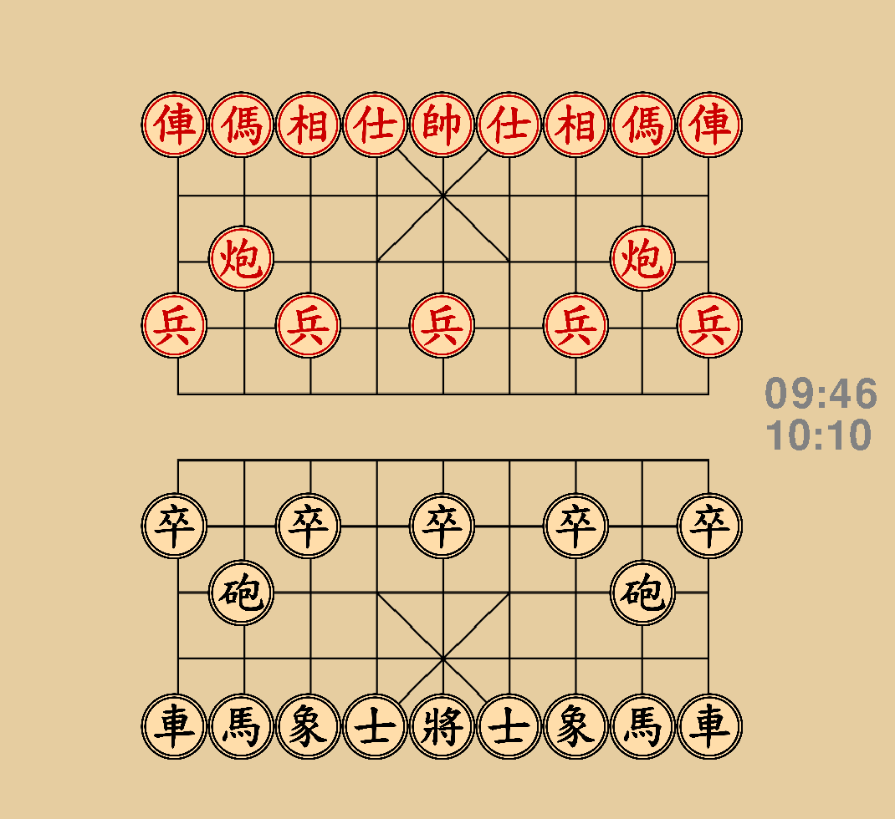

# Xiangqi-AI
- Xiangqi is the chinese version of chess very popular amongst East Asian countries.
- This project's final version will be able to process a physical board and play the best move for you :)

## Table of Contents
* [General Info](#general-information)
* [Features](#features)
* [Screenshots](#screenshots)
* [Dependencies](#dependencies)
* [Project Status](#project-status)
* [To-Dos](#to-dos)
* [Acknowledgements](#acknowledgements)
* [Contact](#contact)
<!-- * [License](#license) -->

## General Information
> **What problem does it intend to solve?**
- The initial goal of this project was to compensate for my own very poor skills in Xiangqi with a computer's ability to crunch millions of numbers in no time and help me beat my grandfather.
- During the process of creation though, I discovered competitions like the national competition of Artificial Intelligence, which also have been contributing to my drive of working on this project
> **What's the purpose of creating the Project?**
- Artificial Intelligence and especially Machine Learning is very often perceived as this intangibly complicated domain of Computer Science, which is partly true, but not true enough to intimidate people into not even trying to get a fundamental grasp of it.
- With undertaking this project, I want to show that consistently achieving minor goals, making slow but steady progress, can accumulate to exceeding and superceding human brain capacity.
- I want people to know that if a normal 14 y/o, just with the help of a computer and research, can understand and implement the basics of AI and ML, can penetrate the imposing barrier of buzzwords and brainfuck, anyone with the same resources can.

## Features

**Move Generation**
- precomputed data + procedual generation
- finished: rook, cannon, horse, advisor, pawn, elephant
- unfinished: king moves, check, checkmate, classifying pinned pieces

**Optimized Minimax (not implemented yet)**
- minimax algorithm
- alpha-beta pruning
- iterative deepening
- position evaluation using CPEF (Combined Position Evaluation Function, weighed sum of SHEF and SLEF)

**Computer Vision (not implemented yet)**
- supervised learning with tensorflow
- classification on physical board (types & positions)

## Screenshots

## Dependencies
- python 3
- tensorflow
- pygame

## Project Status
Project is: _in progress_

## To-dos
- minimax
- computer vision

## Acknowledgements
- Research done at [chessprogramming wiki](https://www.chessprogramming.org/)
- Many thanks to all contributors

## Contact
Created by [@MaSim07](https://github.com/MaSim07) - feel free to contact me at simon.mama07@gmail.com!
