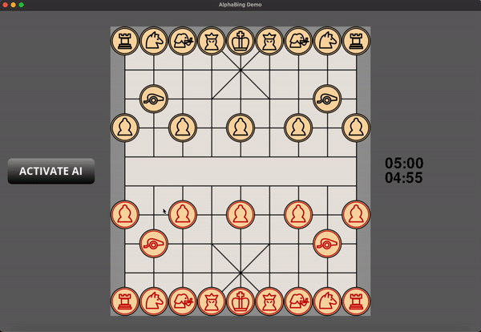

<h1> 
     
    AlphaBing - Combining Algorithmic Powers With The Beauty of Machine Learning
</h1>

## Summary
**The paper and posters (German) are available on [Google Drive](https://drive.google.com/drive/folders/1mfYbBH5obunfqS7T4HJk85F5FU-ZHF8u).**

AlphaBing is a lightweight chinese Chess (Xiangqi) engine, implementing modified concepts of AlphaZero that allow the algorithm to be run on limited hardware. The user can challenge the AI on a minimalistic, user-friendly, and intuitive UI.

The project's goal is to improve the accessibility of the Alpha(Go)Zero algorithm for developers. The new, downscaled, and highly optimized algorithm's full functionality and great efficiency on consumer hardware was demonstrated in the domain of xiangqi. 

At its core, AlphaBing is based on the amalgamation of traditional methods of AI (such as optimized alpha-beta-search) with innovative concepts of reinforcement learning in order to create an agent that allows the strengths of each method to compensate for the detrimental weak points of the other. 

Its development is motivated by the inaccessibility of AlphaZero's codebase to the community and the unaffordable resources required just to run the system. AlphaBing runs smoothly on a single device and plays with adaptable skill levels.

For avid researchers, this repo comes with a number of visualization scripts using matplotlib.

## Installation
### Clone this repository:
```bash
git clone https://github.com/Simuschlatz/AlphaBing
cd AlphaBing
```
## Dependencies
### Using pip:
```bash
pip install -r requirements.txt
```
### Setting up the Environment with Conda
Mac, Windows & Linux
```bash
conda env create -f environment.yml
```
Apple Silicon
```bash
conda env create -f metal.yml
```
Activate the environment
```bash
conda activate cheapchess
```

## Training the agent
```bash
python3 main.py --pipeline --nui
```
Open another terminal, then run:
``` bash
cd [path to this directory]
conda activate cheapchess
tensorboard --logdir core/engine/ai/selfplay_rl/checkpoints/logs
```
## Playing against AI
```bash
python3 main.py
```
## Usage
```bash
usage: main.py [-h] [--chinese] [--perft] [--pipeline] [--eval] [--nui] [--black] [--second] [{ab,az,abz}] [cores] [time]

positional arguments:
  {ab,az,abz}  AI-agent playing in interactive environment (ab: Alpha-Beta, az: AlphaZero, abz: Alpha-Beta-Zero) (default: ab)
  cores        maximum number of processors to use for pipeline (default: multiprocessing.cpu_count())
  time         time on the clock in minutes (default: 5)

options:
  -h, --help   show this help message and exit
  --chinese    rendering chinese style UI
  --perft      run performance tests for move generation speed and accuracy
  --pipeline   run the self-play and training pipeline (to evaluate, see --eval)
  --eval       add evaluation to the pipeline
  --nui        no UI
  --black      play black
  --second     move second
```

## File Structure Overview
```bash
├── LICENSE
├── README.md
├── assets
├── core
│   ├── checkpoints
│   │   └── examples
│   ├── engine
│   │   ├── AI
│   │   │   ├── ABMM
│   │   │   │   ├── AI_diagnostics.py
│   │   │   │   ├── __init__.py
│   │   │   │   ├── agent.py
│   │   │   │   ├── eval_utility.py
│   │   │   │   ├── move_ordering.py
│   │   │   │   ├── piece_square_tables.py
│   │   │   │   ├── search.py
│   │   │   │   └── transposition_table.py
│   │   │   ├── AlphaZero
│   │   │   │   ├── MCTS.py
│   │   │   │   ├── __init__.py
│   │   │   │   ├── agent.py
│   │   │   │   ├── checkpoints
│   │   │   │   │   ├── checkpoint_new.h5
│   │   │   │   │   ├── examples
│   │   │   │   │   └── logs
│   │   │   │   ├── config.py
│   │   │   │   ├── model.py
│   │   │   │   ├── nnet.py
│   │   │   │   └── selfplay.py
│   │   │   ├── EvaluateAgent
│   │   │   │   ├── __init__.py
│   │   │   │   └── evaluate.py
│   │   │   ├── SLEF
│   │   │   │   ├── README.md
│   │   │   │   ├── __init__.py
│   │   │   │   ├── eval_data_black.csv
│   │   │   │   ├── eval_data_collection.py
│   │   │   │   └── eval_data_red.csv
│   │   │   ├── agent_interface.py
│   │   │   └── mixed_agent.py
│   │   ├── UI.py
│   │   ├── __init__.py
│   │   ├── board.py
│   │   ├── clock.py
│   │   ├── config.py
│   │   ├── data_init.py
│   │   ├── fast_move_gen.py
│   │   ├── game_manager.py
│   │   ├── move_generator.py
│   │   ├── piece.py
│   │   ├── precomputed_move_data.py
│   │   ├── test.py
│   │   ├── tt_entry.py
│   │   ├── verbal_command_handler.py
│   │   └── zobrist_hashing.py
│   └── utils
│       ├── __init__.py
│       ├── board_utils.py
│       ├── claim_copyright.py
│       ├── modify_pst.py
│       ├── perft_utility.py
│       ├── select_agent.py
│       └── timer.py
├── environment.yml
├── main.py
├── metal.yml
└── requirements.txt
```

## Methods Roadmap
### Engine
- [x] Move generation
- [x] A novel optimization of Zobrist Hashing
- [x] FEN utility
- [x] Bitboard representation
- [x] UI / UX - pygame, provisional, drag & drop, sound-effects, move-highlighting etc.
<br></br>


### Alpha-Beta-Search
- [x] Piece-square-table implementation
- [x] Minimax-Search with Alpha-Beta-Pruning
- [x] Move ordering
- [x] Multiprocessing
- [ ] Transposition Tables
- [ ] Iterative Deepening

### Reinforcement Learning
- [x] Deep Convolutional ResNet Architecture
- [x] Fast MCTS
- [x] Self-Play policy iteration and Q-Learning
- [x] Training Pipeline
- [x] Evaluation - Elo & win-rate diagnostics
- [x] Parallelism with tensorflow sessions - parallelized pipeline
- [ ] Train the agent on server (in progress)

