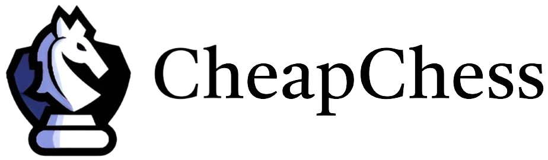

# CheapChess - Combining Algorithmic Powers With The Beauty of Machine Learning

## Disclaimer
Feel free to clone this repo at any time, but keep in mind that sometimes the code may not be completely bug-free. I try my best to only push commits when the program runs smoothly, but sometimes I forget.

## Summary
CheapChess is a lightweight Engine for chinese Chess (Xiangqi), designed to run on normal consumer hardware.
In summary, the idea of CheapChess is the amalgamation of traditional methods of AI with innovative concepts of reinforcement learning in order to create an agent that allows the strengths of each method to compensate for the detrimental weak points of the other. Its development is motivated by the inacccessibility of AlphaZero's codebase to the community and the unaffordable resources required just to run the system.

## Methods
### Engine
- [x] Move generation
- [x] A novel optimization of Zobrist Hashing
- [x] FEN utility
- [x] Bitboard representation
- [x] UI / UX - pygame, provisional, drag & drop, sound-effects, move-highlighting etc.
  

### Alpha-Beta-Search
- [x] Piece-square-table implementation
- [x] Minimax-Search with Alpha-Beta-Pruning
- [x] Move ordering
- [x] Multiprocessing
- [ ] Transposition Tables
- [ ] Iterative Deepening

### Reinforcement Learning
- [x] Deep Convolutional ResNet Architecture
- [x] Fast MCTS
- [x] Self-Play policy iteration and Q-Learning
- [x] Training Pipeline
- [x] Evaluation - Elo & win-rate diagnostics
- [x] Parallelism with tensorflow sessions - parallelized pipeline

